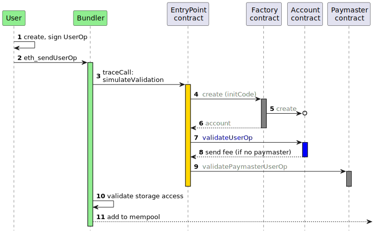

# Semaphore Modular Smart Account Modules

## Project Artifacts

- 👩🏻‍💻 [Project demo UI](https://semaphore-msa-modules.jimmychu0807.hk/) (please connect to Base Sepolia)
- 🎥 [Project demo UI video](https://www.loom.com/share/9775b4fcf71b46418483f34761c03d0e?sid=cb9a32bb-b4ce-4f5a-b1a7-4f9182f59cff)
- 📜 [Writeup about the project](https://jimmychu0807.hk/semaphore-msa-modules)

## Overview

This project mainly consists of [a validator and an executor modules](https://eips.ethereum.org/EIPS/eip-7579#validators) adheres to [**ERC-7579**](https://eips.ethereum.org/EIPS/eip-7579) standard that uses [Semaphore](https://semaphore.pse.dev/) for proof validation. Smart accounts incorporate these modules gain the following benefits:

- The smart account behaves like a **M-of-N multi-sig wallet** controlled by members of the [Semaphore group](https://docs.semaphore.pse.dev/guides/groups) of the smart account. Proofs sent by the members are used as signatures.

- The smart accout gains Semaphore property members preserve their privacy that no one know who send the proof (signature) except they must belong to the group while guaranteeing they have not signed before.

Development of this project is supported by [PSE Acceleration Program](https://github.com/privacy-scaling-explorations/acceleration-program) (see [thread discussion](https://github.com/privacy-scaling-explorations/acceleration-program/issues/72)).

Project Code: FY24-1847

Please refer to the project packages READMEs:
- [packages/contracts](./packages/contracts): Smart contracts of the Semaphore validator and executor module.
- [packages/lib](./packages/lib): Javascript library for interacting with Semaphore modular smart account modules.
- [packages/web](./packages/web): Frontend demo to interact with a smart account and semaphore MSA modules.

## Relevant Information

*Source: [ERC-4337 website](https://www.erc4337.io/docs/understanding-ERC-4337/architecture)*

- [ERC-4337](https://eips.ethereum.org/EIPS/eip-4337):  [overview](https://www.erc4337.io/)
- [ERC-7579](https://eips.ethereum.org/EIPS/eip-7579): [overview](https://erc7579.com/)
- [ERC-7780](https://eips.ethereum.org/EIPS/eip-7780)

## Acknowledgement

Thanks to the following folks on discussing about this project and helps along: 

- [Saleel P](https://github.com/saleel) on initiating this idea with [Semaphore Wallet](https://github.com/saleel/semaphore-wallet), showing me that the idea is feasible.
- [Cedoor](https://github.com/cedoor) and [Vivian Plasencia](https://github.com/vplasencia) on Semaphore development and their opinions.
- [John Guilding](https://github.com/JohnGuilding) on the discussion, support, and review of the project.
- [Rhinestone team](https://rhinestone.wtf/) and [Konrad Kopp](https://github.com/kopy-kat) support on using [ModuleKit](https://docs.rhinestone.wtf/build-modules), [ModuleSDK](https://docs.rhinestone.wtf/build-modules) and a lot more of their work on ERC-7579 that make this project possible, and from which I have learned a lot from.
