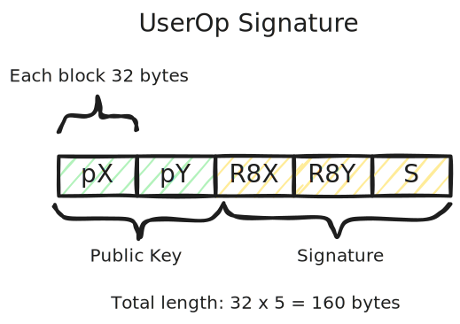
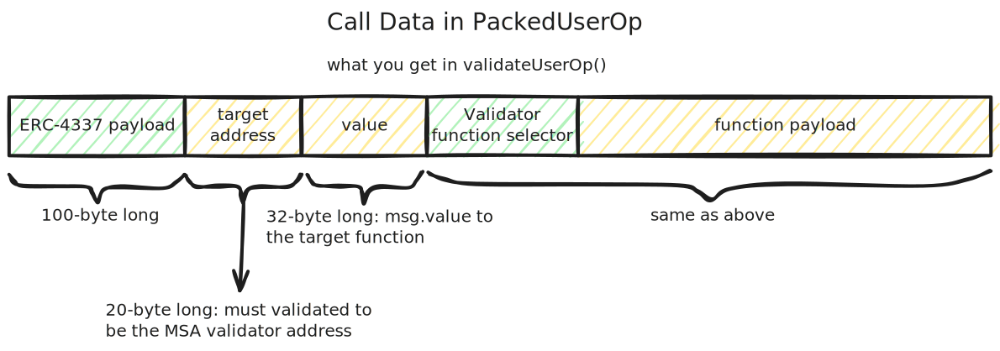

# Semaphore Modular Smart Account Modules

## Overview

This project is a [validator and executor module](https://eips.ethereum.org/EIPS/eip-7579#validators) adheres to [**ERC-7579**](https://eips.ethereum.org/EIPS/eip-7579) standard that uses [Semaphore](https://semaphore.pse.dev/) for proof validation. Smart accounts incorporate this validator gains the following benefits:

- The smart account behaves like a **M-of-N multi-sig wallet** controlled by members of the [Semaphore group](https://docs.semaphore.pse.dev/guides/groups) of the smart account. Proofs sent by the members are used as signatures.

- The smart accout gains Semaphore property members preserve their privacy that no one know who send the proof (signature) except they must belong to the group while guaranteeing they have not signed before.

Development of this project supported by [PSE Acceleration Program](https://github.com/privacy-scaling-explorations/acceleration-program) (see [thread discussion](https://github.com/privacy-scaling-explorations/acceleration-program/issues/72)).

Project Code: FY24-1847

## Using the Module

```shell
# Install dependencies
pnpm install

# Build the project
pnpm run build

# Run unit tests and integration tests
pnpm run test
```

## Developer Documentation

### Smart Contract Storage

[**SemaphoreMSAValidator** contract](./src/SemaphoreMSAValidator.sol) stores the following information on-chain.

- `groupMapping`: This object maps from the smart account address to a Semaphore group.
- `thresholds`: The threshold number of proofs a particular smart account needs to collect for a transaction to be executed.
- `memberCount`: The member count of a Semaphore group. The actual member commitments are stored in the `smaphore` contract [**Lean Incremental Merkle Tree**](https://github.com/privacy-scaling-explorations/zk-kit.solidity/tree/main/packages/lean-imt) structure.
- `acctTxCount`: This object stores the transaction call data and value that are waiting to be proved (signed), and the proofs it has collected so far. This information is stored in the **`ExtCallCount`** data structure.
- `acctSeqNum`: The sequence number corresponding to a smart account. This value is used when generating a transaction signature to uniquely identify a particular transaction.

### API

After installing this validator, the smart account can only call three functions in this validator contract, **initiateTx()**, **signTx()**, and **executeTx()**. Calling other functions, either to other non-validator contract addresses or other funtions beyond the mentioned three, would be rejected in the **validateUserOp()** check.

1. [**initiateTx()**](https://github.com/jimmychu0807/semaphore-msa-validator/blob/4842f2a175d72e8bdd59baf8cdeb46fdefc3a8d5/src/SemaphoreMSAValidator.sol#L215): for the Semaphore member to initate a new transaction of the Smart account. This function checks the validity of the semaphore proof and corresponding parameters. It takes three paramters.

   - `targetAddr`: The target address of the transaction. It can be an EOA for value transfer, or other smart contract address.
   - `txcallData`: The call data to the target address. The first four bytes are the target function selector, and the rest function payload. For EOA value transfer, this value must be null (zero-length byte).
   - `proof`: The zero-knowledge proof genereated off-chain to prove a member signed the transaction and value.
   - `execute`: A boolean value to indicate if the transaction collects enough proof (namely 1 for initiateTx), it will also execute the transaction.

   `msg.value` is used as the **value** to be used for the transaction call. An [**ExtCallCount**](https://github.com/jimmychu0807/semaphore-msa-validator/blob/4842f2a175d72e8bdd59baf8cdeb46fdefc3a8d5/src/SemaphoreMSAValidator.sol#L28) object is created to store the user transaction call data.

   A 32-byte hash **txHash** is returned, generated from `keccak256(abi.encodePacked(seq, targetAddr, msg.value, txCallData))`.

2. [**signTx()**](https://github.com/jimmychu0807/semaphore-msa-validator/blob/4842f2a175d72e8bdd59baf8cdeb46fdefc3a8d5/src/SemaphoreMSAValidator.sol#L265): for other Semaphore member to sign a previously initiated transaction. Again, it checks the Semaphore proof, if the hash and the proof are valid, the proof count is incremented.

   - `txHash`: The hash value returned from `initiatedTx()`, to specify the transaction for signing
   - `proof`: The zero-knowledge proof for the transaction `txHash` corresponding to.
   - `execute`: Same as initiateTx().

3. [**executeTx()**](https://github.com/jimmychu0807/semaphore-msa-validator/blob/4842f2a175d72e8bdd59baf8cdeb46fdefc3a8d5/src/SemaphoreMSAValidator.sol#L294): call to execute the transaction specified by `txHash`. If the transaction hasn't collected enough proofs, it would revert.

   - `txHash`: Same as initiateTx().

### Signature and Calldata

Transactions from ERC-4337 will go through **validateUserOp()** for validation, based on **userOp**, and **userOpHash**. In validation, the key logic is to check the userOp hash (`userOpHash`), the signature (`signature`), and the target call data (`targetCallData`).

A proper userOp signature is a 160 bytes value signed by EdDSA signature scheme. The signature itself is 32 * 3 = 96 bytes, but we also prepend the identity public key in it to be used for validation.



The `userOpHash` is 32-byte long, it is a **keccak256()** of sequence number, target address, value, and the target parameters.

For the UserOp calldata passing to `getExecOps()` in testing, it is:


Now, when decoding the calldata from [**PackedUserOperation** object](https://github.com/jimmychu0807/semaphore-msa-validator/blob/4842f2a175d72e8bdd59baf8cdeb46fdefc3a8d5/src/SemaphoreMSAValidator.sol#L322) in **validateUserOp()**, the above calldata is combined with other information and what we are interested started from the 100th byte, as shown below.



### Verifying EdDSA Signature

A Semaphore identity consists of an [EdDSA](https://en.wikipedia.org/wiki/EdDSA) public/private key pair and a [commitment](https://docs.semaphore.pse.dev/glossary#identity-commitment). Semaphore uses an [EdDSA](https://github.com/privacy-scaling-explorations/zk-kit/tree/main/packages/eddsa-poseidon) implementation based on [Baby Jubjub](https://eips.ethereum.org/EIPS/eip-2494) and [Poseidon](https://www.poseidon-hash.info/). The actual implementation is in [**zk-kit**](https://github.com/privacy-scaling-explorations/zk-kit) repository. 

We implement the identity verification logic [**Identity.verifySignature()**](https://github.com/jimmychu0807/semaphore-msa-validator/blob/4842f2a175d72e8bdd59baf8cdeb46fdefc3a8d5/src/utils/Identity.sol#L39) on-chain. We also have a **[Identity.verifySignatureFFI()](https://github.com/jimmychu0807/semaphore-msa-validator/blob/4842f2a175d72e8bdd59baf8cdeb46fdefc3a8d5/src/utils/Identity.sol#L20)** function for testing to compare the result with calling Semaphore typescript-based implementation. It relies on the Baby JubJub curve Solidity implementataion by [yondonfu](https://github.com/yondonfu/sol-baby-jubjub) with [a minor fix](https://github.com/jimmychu0807/semaphore-msa-validator/blob/4842f2a175d72e8bdd59baf8cdeb46fdefc3a8d5/src/utils/CurveBabyJubJub.sol#L4-L5).

### ERC-1271

The module is also compatible with: 

- [ERC-1271](https://eips.ethereum.org/EIPS/eip-1271): Accepting signature from other smart contract by implementing `isValidSignatureWithSender()`.

### Testing

The testing code relies heavily on [Foundry FFI](https://book.getfoundry.sh/cheatcodes/ffi) to call Semaphore typescript API to generate zero-knowledge proof and EdDSA signature.

### Other Notes

- When a smart account is calling other payable functions or transfer native tokens, the tokens are transfer to this module at the point of `initiateTx()`, and finally send over to the target at `executeTx()`.


## Relevant Information

### ERC-4337 Lifecycle on Validation


*Source: [ERC-4337 website](https://www.erc4337.io/docs/understanding-ERC-4337/architecture)*

- [ERC-4337](https://eips.ethereum.org/EIPS/eip-4337):  [overview](https://www.erc4337.io/)
- [ERC-7579](https://eips.ethereum.org/EIPS/eip-7579): [overview](https://erc7579.com/)
- [ERC-7780](https://eips.ethereum.org/EIPS/eip-7780)

## Contributions

Thanks to the following folks on discussing about this project and helps along: 

- [Saleel P](https://github.com/saleel) on initiating this idea with [Semaphore Wallet](https://github.com/saleel/semaphore-wallet), showing me that the idea is feasible.
- [Cedoor](https://github.com/cedoor) and [Vivian Plasencia](https://github.com/vplasencia) on Semaphore development and their opinions.
- [John Guilding](https://github.com/JohnGuilding) on the discussion, support, and review of the project.
- [Konrad Kopp](https://github.com/kopy-kat) on the support of using [ModuleKit](https://github.com/rhinestonewtf/modulekit) framework which this module is built upon, and answering my question on some details of ERC-4337 standard.
