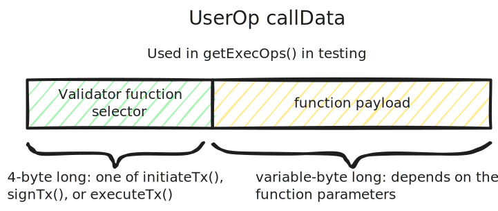
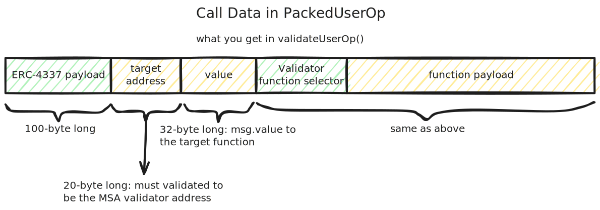

# Semaphore Modular Smart Account Modules - Contracts

## Using the Module

```shell
# Setup the proper environment file
ln -sf ../../.env .env

# Install dependencies
pnpm install

# Build the project
pnpm run build

# Run unit tests and integration tests
pnpm run test
```

## Deployment

**Base Sepolia**

- PoseidonT3: [`0xE132Ed561A4F8500e86c4725221c23BF82219b6B`](https://base-sepolia.blockscout.com/address/0xE132Ed561A4F8500e86c4725221c23BF82219b6B?tab=contract)
- SemaphoreVerifier: [`0x7d843DdF0d2Ad656C5FD5E825C69C8C04241114D`](https://base-sepolia.blockscout.com/address/0x7d843DdF0d2Ad656C5FD5E825C69C8C04241114D?tab=contract)
- Semaphore: [`0x18E38db79b148d25e8b2E859985731AED274173a`](https://base-sepolia.blockscout.com/address/0x18E38db79b148d25e8b2E859985731AED274173a?tab=contract)
- SemaphoreExecutor: [`0x58265b1deb6290a092a3b01da1d96475c012d8f4`](https://base-sepolia.blockscout.com/address/0x58265b1deb6290a092a3b01da1d96475c012d8f4?tab=contract)
- SemaphoreValidator: [`0xBC564d498Efa954eeB1169066D6AD1f82cC2a37b`](https://base-sepolia.blockscout.com/address/0xBC564d498Efa954eeB1169066D6AD1f82cC2a37b?tab=contract)

## Developer Documentation

There are two ERC-7579 modules in this repo, namely [**SemaphoreExecutor**](./src/SemaphoreExecutor.sol) and [**SemaphoreValidator**](./src/SemaphoreValidator.sol). 

**SempahoreExecutor** has all the account states stored and provides three key APIs: **initiateTx()**, **signTx()**, and **executeTx()**. **initiateTx()** is responsible for Semaphore members of the smart account to initiate an external transaction. **signTx()** is for collecting enough proofs. The proofs could be seen as a "signature" from the members who approve the tx. Lastly, **executeTx()** is to trigger the execution of the transaction.

**SemaphoreValidator** is responsible for checking the UserOp signature is indeed a valid EdDSA signature of the UserOp hash. The validator module also checks the commitment of the public key included in the UserOp signature is a member of the smart account Sempahore group. This module further limits the smart account to be able to only call **SempahoreExecutor** contract and its three APIs (`initiateTx()`, `signTx()`, and `executeTx)`.

Because **SemaphoreExecutor** is an [executor module](https://eips.ethereum.org/EIPS/eip-7579#executors), the called contract will see the smart account as the `msg.sender`, not the executor contract.

There is a one-time set function **setSemaphoreValidator()** in the executor to set the associated validator. This is to ensure that a smart account uninstall the validator first before the executor. Otherwise it will render the smart account unusable.

### Smart Contract Storage

[**SemaphoreExecutor** contract](./src/SemaphoreExecutor.sol) stores the following information on-chain.

- `groupMapping`: This object maps from the smart account address to a Semaphore group.
- `thresholds`: The threshold number of proofs a particular smart account needs to collect for a transaction to be executed.
- `acctMembers`: This list stores the member commitments of a smart account to be checked against when validating a userOp signature. The actual member commitments are stored in the `smaphore` contract [**Lean Incremental Merkle Tree**](https://github.com/privacy-scaling-explorations/zk-kit.solidity/tree/main/packages/lean-imt) structure.
- `acctTxCount`: This object stores the transaction calldata, to, and value that are waiting to be proved (signed) and the proofs it has collected so far. This information is stored in the **`ExtCallCount`** data structure.
- `acctSeqNum`: The sequence number corresponding to a smart account. This value is used when generating a transaction signature to uniquely identify a particular transaction.

### API

After installing the two modules, the smart account can only call three functions in the executor module, **initiateTx()**, **signTx()**, and **executeTx()**. Calling other functions would be rejected in the Semaphore validator **validateUserOp()** check.

1. **initiateTx()**: for the Semaphore member to initate a new transaction of the smart account. This function checks the validity of the semaphore proof and corresponding parameters. It takes five paramters.

   - `target`: The target address of the transaction.
   - `value`: any balance to be used. It will be used as the `msg.value` in the actual external transaction.
   - `callData`: The call data to the target address. The first four bytes are the target function selector, and the rest function payload. For EOA value transfer, this value should be null (zero-length byte).
   - `proof`: The zero-knowledge Semaphore proof generated off-chain to prove a member signs the transaction.
   - `execute`: Boolean value to indicate if the transaction reaches the proof collection threshold, whether to execute the transaction immediately.

   An **ExtCallCount** object is created to store the user transaction call data.

   A 32-byte hash **txHash** is returned, generated from `keccak256(abi.encodePacked(seq, targetAddr, value, txCallData))`.

2. **signTx()**: for other Semaphore member to sign a previously initiated transaction. Again, it checks the Semaphore proof, and if valid, increment the proof count of the transaction.

   - `txHash`: The hash value returned from `initiatedTx()` previously, to specify the proving transaction.
   - `proof`: The zero-knowledge Semaphore proof that the transaction `txHash` corresponding to.
   - `execute`: Same as initiateTx().

3.**executeTx()**: call to execute the transaction specified by `txHash`. If the transaction hasn't collected enough proofs, it would revert.

   - `txHash`: Same as initiateTx().

### Signature and Calldata

Transactions from ERC-4337 will go through **validateUserOp()** for validation, based on **userOp**, and **userOpHash**. In SemaphoreValidator, the key logic is to check two objects: the userOp signature (`signature`) and the target call data (`targetCallData`).

A proper userOp signature is a 160 bytes value signed by EdDSA signature scheme. The signature itself is 32 * 3 = 96 bytes, but we also prepend the identity public key uses for validation.


A `userOpHash` is 32-byte long, it is a **keccak256()** of sequence number, target address, value, and the target parameters.

For the UserOp calldata passing to `getExecOps()` in testing, it is:



Now, when decoding the calldata from **PackedUserOperation** object in **validateUserOp()**, the above calldata is combined with other information and what we are interested started from the 100th byte, as shown below.



### Verifying EdDSA Signature

Semaphore uses an [EdDSA signature scheme](https://github.com/privacy-scaling-explorations/zk-kit/tree/main/packages/eddsa-poseidon) on [Baby Jubjub elliptic curve](https://eips.ethereum.org/EIPS/eip-2494) and [Poseidon hashing](https://www.poseidon-hash.info/). The actual implementation is in [**zk-kit**](https://github.com/privacy-scaling-explorations/zk-kit) repository. 

We implement the identity verification logic [**Identity.verifySignature()**](./src/utils/Identity.sol) on-chain. It is based on the Baby JubJub curve Solidity implementataion by [yondonfu](https://github.com/yondonfu/sol-baby-jubjub).

### ERC-1271 and ERC-7780

The module is also compatible with: 

- [ERC-1271](https://eips.ethereum.org/EIPS/eip-1271): Accepting signature from other smart contract by implementing `isValidSignatureWithSender()`.
- [ERC-7780](https://eips.ethereum.org/EIPS/eip-7780): Being a **Stateless Validator** by implementing `validateSignatureWithData()`.

### Testing

The testing code relies on [Foundry FFI](https://book.getfoundry.sh/cheatcodes/ffi) to call Semaphore typescript API to generate zero-knowledge proof and EdDSA signature.
